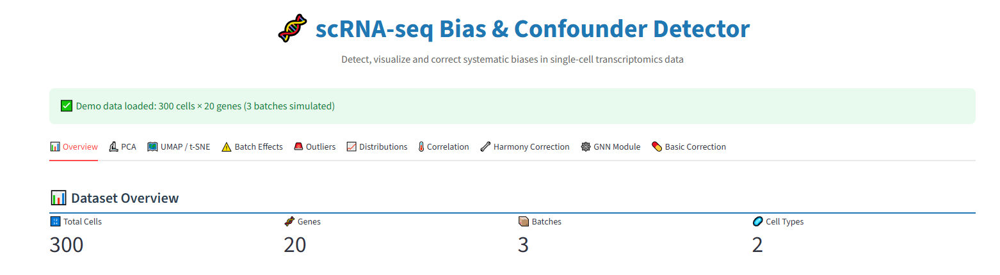

# 🧬 scRNA-seq Bias Detector
### An Integrated Unsupervised Anomaly Recognition and Multi-Track Quality Control Framework for Single-Cell Transcriptomics

[](https://www.python.org/downloads/)
[](https://scrna-bias-detector.streamlit.app/)
[](https://opensource.org/licenses/MIT)

[](https://orcid.org/0009-0003-3443-4413)

---

## Overview

<p align="center">
  
</p>

**scRNA-seq Bias Detector** is an interactive computational genomics framework that integrates classical statistical methods with modern machine learning approaches to detect, quantify, and visualize batch effects and anomalous cells in single-cell RNA sequencing data.

The platform provides a unified interface for:

- Statistical batch effect detection via differential expression analysis
- PCA-based batch separation quantification
- Unsupervised anomaly detection via Isolation Forest
- Gene expression quality control metrics
- UMAP / t-SNE nonlinear dimensionality reduction
- Harmony batch integration and correction validation
- Graph Neural Network (GNN) cell similarity analysis

scRNA-seq Bias Detector aims to serve both as a research quality control checkpoint and an educational computational genomics toolkit for wet-lab and computational researchers alike.

This repository accompanies the preprint:

> **Nama, Y. (2026).**
> *scRNA-seq Bias Detector: An Integrated Unsupervised Anomaly Recognition and Multi-Track Quality Control Framework for Single-Cell Transcriptomics.*
> Research Square. https://doi.org/10.21203/rs.3.rs-XXXXXXX/v1

---

## Biological Motivation

Batch effects in scRNA-seq arise from multiple technical sources and can mask true biological signals if not properly assessed before downstream analysis:

- Platform differences (10x Genomics, Drop-seq, Smart-seq2)
- Sequencing depth variation across experiments
- Temporal drift in protocols and reagents
- Sample preparation and cell handling variability
- Environmental and operator-dependent variation

scRNA-seq Bias Detector provides a modular environment where batch assessment, outlier detection, and quality control can be performed within a single interactive framework — without requiring programming expertise.

The platform addresses questions such as:

1. Which genes are most significantly affected by batch effects?
2. How much of the leading variance is driven by technical rather than biological variation?
3. Which cells are anomalous and should be flagged for removal?
4. Does Harmony batch correction improve embedding quality?
5. Does the cell neighbourhood graph reveal additional outlier populations?

---

## System Architecture

scRNA-seq Bias Detector follows a modular architecture integrating eight complementary analytical modules.

```text
Raw scRNA-seq Data (CSV / TSV)
         ↓
Module 1: Differential Expression Analysis (Batch-Biased Genes)
         ↓
Module 2: PCA Batch Separation Quantification
         ↓
Module 3: Isolation Forest Anomaly Detection
         ↓
Module 4: Gene Expression QC Metrics
         ↓
Module 5: UMAP / t-SNE Nonlinear Dimensionality Reduction
         ↓
Module 6: Harmony Batch Correction & Validation
         ↓
Module 7: GNN Cell Similarity Analysis
         ↓
Unified Quality Report + Severity Classification
```

Each module operates independently or as part of the integrated analysis pipeline.

---

## Core Modules

### 1️⃣ Batch Effect Detection — Differential Expression Analysis

Statistical identification of batch-biased genes.

Features:
- Welch's t-test for pairwise batch group comparison
- Per-gene batch-effect severity classification (minimal / moderate / severe)
- Bar plots of top biased genes ranked by mean expression difference
- −log₁₀(p) histogram with user-defined threshold

Applications:
- Pre-correction batch severity assessment
- Identification of genes driving technical variation
- Decision support for downstream correction strategy

---

### 2️⃣ PCA Batch Separation Quantification

Linear dimensionality reduction for quantitative batch assessment.

Capabilities:
- Standardized PCA on gene expression matrix
- PC1 vs PC2 biplot coloured by batch assignment
- Scree plot of variance explained per component
- Welch's t-test on PC1 scores for quantitative batch separation evidence

Applications:
- Rapid visual batch effect diagnosis
- Quantitative confirmation of batch-induced clustering
- Input for Harmony correction module

---

### 3️⃣ Isolation Forest Anomaly Detection

Unsupervised detection of anomalous and contaminating cells.

Implements:
- Isolation Forest ensemble algorithm (O(n log n))
- Anomaly score distribution histogram
- PCA biplot with outlier cells highlighted
- Tunable contamination rate parameter

Applications:
- Doublet and multiplet identification
- Dead / dying cell detection
- Technical artifact flagging

---

### 4️⃣ Gene Expression Quality Control Metrics

Comprehensive per-gene quality profiling.

Features:
- Mean expression distribution
- Variance distribution with low-variance threshold
- Zero-inflation (dropout) rate per gene
- Heatmap of top 20 most variable genes

Applications:
- Low-information gene filtering
- Data quality assessment prior to clustering
- Zero-inflation profiling for method selection

---

### 5️⃣ UMAP / t-SNE Nonlinear Dimensionality Reduction

Nonlinear batch mixing assessment beyond PCA.

Features:
- UMAP with tunable `n_neighbors` and `min_dist`
- t-SNE with tunable perplexity and max iterations
- Session-state-based Run button (no unnecessary reruns)
- Colour by batch or cell type

Applications:
- Nonlinear cell population visualization
- Residual batch effect detection post-correction
- Cluster structure exploration

---

### 6️⃣ Harmony Batch Correction & Validation

State-of-the-art batch integration with quantitative evaluation.

Implements:
- Harmony iterative PCA embedding correction
- Before vs after PCA embedding comparison
- Quantitative batch separation score (mean centroid distance)
- Percentage improvement metric
- Downloadable Harmony-corrected embedding (CSV)

Applications:
- Batch correction for downstream clustering
- Integration quality benchmarking
- Multi-batch single-cell experiment preprocessing

---

### 7️⃣ Graph Neural Network Cell Similarity Analysis

Graph-based neighbourhood-aware anomaly detection.

Features:
- k-nearest neighbour (kNN) cell graph construction
- 1-layer GCN smoothing approximation (sklearn fallback)
- Full 2-layer GCN via PyTorch Geometric (optional)
- GCN-smoothed embedding visualization
- Cell graph statistics (edges, degree, density)

Applications:
- Neighbourhood-aware outlier detection
- Cell similarity network analysis
- Graph-based representation learning for scRNA-seq

---

## Interactive Dashboard

The Streamlit interface provides real-time interaction with scRNA-seq datasets.

Capabilities include:
- Dynamic parameter tuning via sidebar sliders
- Real-time visualization across all analytical modules
- Anomaly score histograms, PCA biplots, and UMAP embeddings
- Exportable CSV outputs (Harmony-corrected embeddings, corrected expression)
- Built-in demo datasets and PBMC Kang et al. 2018 benchmark

The interface enables rigorous quality control without requiring programming expertise.

**Live Web App:**
https://scrna-bias-detector.streamlit.app/

---

## Example Datasets

scRNA-seq Bias Detector includes three built-in datasets for demonstration:

| Dataset | Cells | Genes | Batches | Purpose |
|---|---|---|---|---|
| Demo (simulated) | 300 | 20 | 3 | Synthetic batch effect demonstration |
| PBMC Kang et al. 2018 (semi-synthetic) | 1,200 | 50 | 2 | Biologically realistic IFN-β stimulation benchmark |
| User CSV upload | Custom | Custom | Custom | Real-world dataset analysis |

---

## 📂 Repository Structure

```text
scrna-bias-detector/
│
├── app.py                  # Main Streamlit application (v2.0)
├── requirements.txt        # Python dependencies
├── README.md               # This file
├── LICENSE                 # MIT License
├── dashboard.png           # App screenshot for README
└── assets/                 # Example datasets and figures
```

---

## 🛠 Installation

**1️⃣ Clone the repository**
```bash
git clone https://github.com/YASH4-HD/scrna-bias-detector.git
cd scrna-bias-detector
```

**2️⃣ Install dependencies**
```bash
pip install -r requirements.txt
```

**3️⃣ Launch the dashboard**
```bash
streamlit run app.py
```

Access at: http://localhost:8501

**Optional: GPU-accelerated GNN support**
```bash
pip install torch torch-geometric
```

---

## 🔁 Reproducibility

All analyses are reproducible using:

- Fixed random seeds (`random_state=42`) across all stochastic algorithms
- Defined synthetic and semi-synthetic benchmark datasets (included in repository)
- Explicit algorithm implementations with documented parameter defaults
- Open-source Python libraries (no proprietary dependencies)

The platform does not require proprietary datasets or institutional computing resources.

---

## 📜 Citation

If you use this framework in your research, please cite:

> **Nama, Y. (2026).** *scRNA-seq Bias Detector: An Integrated Unsupervised Anomaly Recognition and Multi-Track Quality Control Framework for Single-Cell Transcriptomics.* Research Square. https://doi.org/10.21203/rs.3.rs-XXXXXXX/v1

---

## Author

**Yashwant Nama**
*Independent Computational Researcher | Jaipur, Rajasthan, India*

**Focus:** Single-cell Genomics, Systems Immunology, Computational Biology, and Reproducible Bioinformatics.

🔗 **Connect & Verify:**
- **ORCID:** [0009-0003-3443-4413](https://orcid.org/0009-0003-3443-4413)
- **LinkedIn:** [Yashwant Nama](https://www.linkedin.com/in/yashwant-nama-232b2437b/)
- **Live App:** [scrna-bias-detector.streamlit.app](https://scrna-bias-detector.streamlit.app/)
- **Email:** nama.yashwant@gmail.com

---

💡 **scRNA-seq Bias Detector bridges the gap between wet-lab biological intuition and the algorithmic foundations of quality control in single-cell genomics.**
